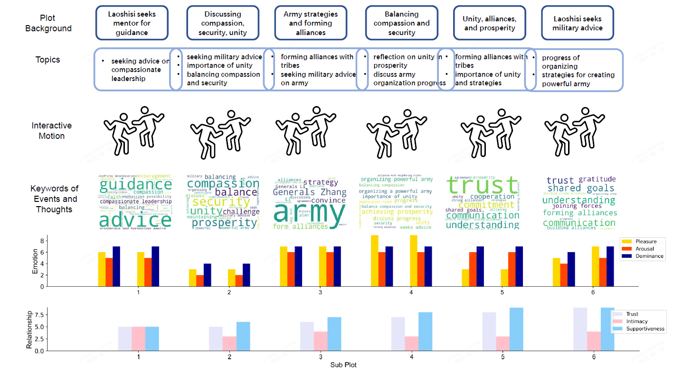

# DLP-SocioMind
Official Code of SocioMind for CVPR 2024 paper *Digital Life Project: Autonomous 3D Characters with Social Intelligence*.


## Useful links

<div align="center">
    <a href="https://digital-life-project.com/" class="button"><b>[Homepage]</b></a> &nbsp;&nbsp;&nbsp;&nbsp;
    <a href="https://arxiv.org/abs/2312.04547" class="button"><b>[arXiv]</b></a> &nbsp;&nbsp;&nbsp;&nbsp;
    <a href="https://www.youtube.com/watch?v=rj0QEdGbSMs" class="button"><b>[Video]</b></a>
&nbsp;&nbsp;&nbsp;&nbsp;
    <a href="https://openxdlab.oss-cn-shanghai.aliyuncs.com/Digital_Life_Project/sociomind_asset.zip" class="button"><b>[Assets]</b></a>
</div>


## Preparation
### Environment Installation
```bash
conda create -n sociomind python=3.11
conda activate sociomind     
pip install -r requirements.txt
```

### Assets
Download the required [assets](https://openxdlab.oss-cn-shanghai.aliyuncs.com/Digital_Life_Project/sociomind_asset.zip) of SocioMind and extract them as:
```
-assets
    -sociomind
        -Arial.ttf
        -ipip_table.xlsx
        -persona_database.npy
        -spatial_map.json
```
If you want to generate the database of persona instructions, you can modify the file path of persona_database in config yamls in ``digital_life_project/characters/configs/``.

### LLM API
If your API service is OpenAI, please follow the [tutorials](https://platform.openai.com/docs/quickstart) to set the ``OPENAI_API_KEY`` and ``OPENAI_BASE_URL`` in your environment.

If you use the OpenAI service from Azure, please set the ``AZURE_OPENAI_API_KEY`` and ``AZURE_OPENAI_ENDPOINT`` in the environment.

For other LLM options, please refer to ``digital_life_project/characters/llm_api/gpt_prompt_base.py`` for customization.
Default LLM model for SocioMind is ``gpt-4o``, and text model is ``text-embedding-ada-002``.

## Experiments

### AI Society Simulation
In AI society simulations, we can run only the SocioMind component, which is an LLM-Agent structure based on psychological theories and is associated with the behaviors of 3D avatars in the text domain.
```
python sociomind_ai_society.py 
    --config qiqiang_anxin.yaml 
    --llm_service_type azure
```

- ``config``: Config path for AI society simulation;
- ``llm_service``: LLM service type, 'openai' or 'azure';
- ``replay_dir``: You can continue your simulation from the output direction (one of the plot) of previous simulation.

Results are saved in the direction ``outout``.
You can check the txt and csv format recordings of the simulation.
Besides, you can refer to each plot for visualization of emotion, keywords, and realationship.

### Config Settings for Simulation
Config settings are put in ``digital_life_project/characters/configs``.
Here we introduce some important parameters in the ``XXX.yaml`` files.

- ``mode``: (Options: `preconfigured`, `autonomous`, `event-driven`. Default: autonomous). `preconfigured`: user can preset the behavior of the two characters in the config yaml. `event-driven`: user can manually set the events of each character in each plot. `autonomous`: plots can be generated autonomously.

- ``characters_info``: A dict about the personality (Big Five Model), emotion (PAD model), motivation, core self, and relationships of each character. For quantitation of the proposed dimension, we use a Likert Scale: 1 ~ 9.

- ``plot_length``: Maximal plots in this simulation.

- ``max_round_per_plot``: Maximal rounds of interaction in each plot.

- ``plot_id``: Plot id to start the simulation, espically for replay.

- ``events``: Settings for `event-driven` mode. Events are in a list format. K-th item means the manual events at the K-th plot.

- ``predefined_plots``: Settings for `preconfigured` mode. 

### Evaluation

We provide evaluation scripts in ``digital_life_project/characters/evaluation.py`` if you want to do ablation study.



## Citation

```bibtex
@inproceedings{Cai2024DLP,
      title={Digital Life Project: Autonomous 3D Characters with Social Intelligence}, 
      author={Zhongang Cai, Jianping Jiang, Zhongfei Qing, Xinying Guo, Mingyuan Zhang, Zhengyu Lin, Haiyi Mei, Chen Wei, Ruisi Wang, Wanqi Yin, Xiangyu Fan, Han Du, Liang Pan, Peng Gao, Zhitao Yang, Yang Gao, Jiaqi Li, Tianxiang Ren, Yukun Wei, Xiaogang Wang, Chen Change Loy, Lei Yang, Ziwei Liu},
      booktitle={CVPR},
      year={2024}
}
```

## Acknowledgement
Our code of SocioMind is based on [Generative Agents](https://github.com/joonspk-research/generative_agents). 
